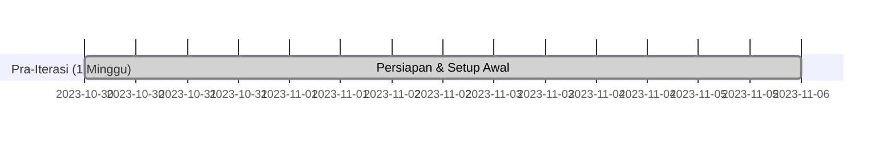

    section Iterasi 1: Fondasi Pengguna (2 Minggu)
    Otentikasi Dasar (F001)        :p_iter1, after p_prep, 14d
    %% Task Checklist Iterasi 1
    %% [ ] UI: Layar Registrasi, Login, Home Dasar
    %% [ ] Backend: Implementasi Registrasi Pemain (Appwrite account.create)
    %% [ ] Backend: Implementasi Login Pemain (Appwrite account.createEmailSession, account.get)
    %% [ ] Backend: Implementasi Logout (Appwrite account.deleteSession)
    %% [ ] Frontend: Routing dasar & proteksi halaman Home
    %% [ ] Appwrite: Setup Collection `users` & permissions dasar
    %% [ ] Testing: Alur Registrasi, Login, Logout Pemain

    section Iterasi 2: Setup SC & Admin SC Dasar (1.5 Minggu)
    Manajemen SC Awal (F006, F011) :p_iter2, after p_iter1, 11d %% 1.5 minggu * 7 hari = 10.5, bulatkan ke 11
    %% Task Checklist Iterasi 2
    %% [ ] Appwrite: Setup Collection `sport_centers` & `fields`
    %% [ ] Appwrite: Buat Akun Super Admin (Manual)
    %% [ ] Appwrite: Buat Data SC & Fields Dummy (Manual)
    %% [ ] Appwrite: Buat Team untuk setiap SC Dummy
    %% [ ] Appwrite: Buat Akun Admin SC (Manual, assign ke SC & Team)
    %% [ ] Frontend: Implementasi Login Admin SC & deteksi peran
    %% [ ] Frontend: UI Dashboard Admin SC (Dasar)
    %% [ ] Frontend: UI Tampilan Profil SC (Read-Only untuk Admin SC)
    %% [ ] Testing: Login Admin SC & tampilan data SC

    section Iterasi 3: Pemain Lihat SC & Lapangan (2 Minggu)
    Pencarian & Detail (F002, F003) :p_iter3, after p_iter2, 14d
    %% Task Checklist Iterasi 3
    %% [ ] Frontend: UI Pencarian Pemain (jenis olahraga, kota)
    %% [ ] Backend: Logika Pencarian SC (filter kota, client-side filter sport)
    %% [ ] Frontend: UI Tampilan Hasil Pencarian SC
    %% [ ] Frontend: UI Detail SC (info SC, daftar lapangan)
    %% [ ] Backend: Ambil data lapangan untuk SC terpilih
    %% [ ] Frontend: UI Detail Lapangan (info lengkap lapangan)
    %% [ ] Testing: Alur pencarian SC, tampilan detail SC & lapangan

    section Iterasi 4: Ketersediaan & Booking Pemain (2.5 Minggu)
    Booking Pemain (F004, F005)    :p_iter4, after p_iter3, 18d %% 2.5 minggu * 7 hari = 17.5, bulatkan ke 18
    %% Task Checklist Iterasi 4
    %% [ ] Appwrite: Setup Collection `bookings` & `blocked_slots`
    %% [ ] Frontend: UI Tampilan Ketersediaan (pilih tanggal, slot waktu)
    %% [ ] Backend: Logika Cek Ketersediaan (query bookings & blocked_slots)
    %% [ ] Backend: Implementasi Realtime Ketersediaan (Appwrite Realtime subscribe)
    %% [ ] Frontend: UI Proses Pemesanan & Konfirmasi
    %% [ ] Backend: Logika Pembuatan Booking (createDocument di `bookings`)
    %% [ ] Frontend: UI Tampilan Riwayat Pemesanan Pemain
    %% [ ] Backend: Ambil data riwayat booking pemain
    %% [ ] Testing: Tampilan ketersediaan (realtime), proses booking, riwayat booking

    section Iterasi 5: Manajemen oleh Admin SC (3 Minggu)
    Manajemen SC Lanjut (F006-F008, F010) :p_iter5, after p_iter4, 21d
    %% Task Checklist Iterasi 5
    %% [ ] Frontend/Backend: Manajemen Profil SC oleh Admin SC (Update info SC)
    %% [ ] Frontend/Backend: Manajemen Lapangan oleh Admin SC (CRUD Lapangan)
    %% [ ] Frontend: UI Kalender/Jadwal Admin SC
    %% [ ] Frontend/Backend: Fitur Blokir Slot oleh Admin SC (createDocument di `blocked_slots`)
    %% [ ] Frontend/Backend: Fitur Tambah Booking Manual oleh Admin SC
    %% [ ] Frontend/Backend: Lihat & Kelola Daftar Pemesanan oleh Admin SC (update status)
    %% [ ] Testing: Semua fitur manajemen Admin SC, pastikan efeknya terlihat di sisi pemain

    section Iterasi 6: Penyempurnaan & Rilis (2 Minggu)
    Testing & Finalisasi MVP        :crit, p_iter6, after p_iter5, 14d
    %% Task Checklist Iterasi 6
    %% [ ] Testing: End-to-End semua alur utama
    %% [ ] Perbaikan Bug: Mayor & Kritikal
    %% [ ] UI/UX: Review & penyempurnaan kecil
    %% [ ] KNF: Cek performa dasar & keamanan
    %% [ ] Persiapan Build: Ikon, Splash Screen, Konfigurasi Build (Android/iOS)
    %% [ ] Dokumentasi: FAQ Pengguna Sederhana (Opsional)
    %% [ ] Final Testing: Sebelum rilis ke pengguna awal
```
