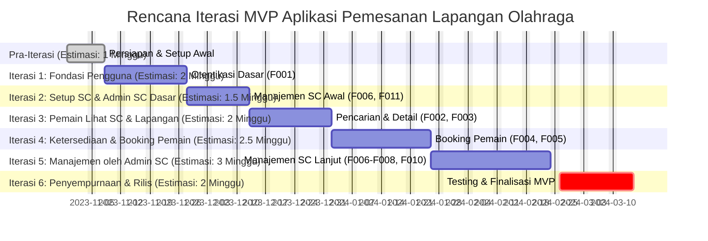

```mermaid
gantt
    dateFormat  YYYY-MM-DD
    title Rencana Iterasi MVP Aplikasi Pemesanan Lapangan Olahraga
    excludes    weekends

    section Pra-Iterasi (Estimasi: 1 Minggu)
    Persiapan & Setup Awal            :done, p_prep, 2023-10-30, 7d
    %% Tasks Pra-Iterasi:
    %% - Pahami SRS Lagi
    %% - Setup Lingkungan Flutter (SDK, Editor, Emulator/Device)
    %% - Setup Project Appwrite (Instalasi Lokal/Cloud, Buat Project)
    %% - Buat Struktur Project Flutter Awal (Folders, Basic Files)
    %% - Integrasi Awal Flutter dengan Appwrite Client (Inisialisasi)

    section Iterasi 1: Fondasi Pengguna (Estimasi: 2 Minggu)
    Otentikasi Dasar (F001)        :p_iter1, after p_prep, 14d
    %% Tasks Iterasi 1:
    %% - UI: Desain & Implementasi Layar Registrasi (Nama, Email, Password, Konfirmasi Pass)
    %% - UI: Desain & Implementasi Layar Login (Email, Password)
    %% - UI: Desain & Implementasi Layar Home Sederhana (Placeholder)
    %% - Backend: Implementasi Fungsi Registrasi Pemain (Appwrite `account.create()`, set `prefs.role='player'`)
    %% - Backend: Implementasi Fungsi Login Pemain (Appwrite `account.createEmailSession()`, `account.get()`)
    %% - Backend: Implementasi Fungsi Logout (Appwrite `account.deleteSession('current')`)
    %% - Frontend: Implementasi Routing dasar (Navigasi antar layar)
    %% - Frontend: Proteksi Layar Home (Hanya bisa diakses setelah login)
    %% - Appwrite: Setup Collection `users` (jika belum ada) & Atribut dasar (nama, email, prefs.role)
    %% - Appwrite: Atur Permissions dasar untuk Collection `users`
    %% - Testing: Alur lengkap Registrasi, Login, dan Logout untuk peran 'player'

    section Iterasi 2: Setup SC & Admin SC Dasar (Estimasi: 1.5 Minggu)
    Manajemen SC Awal (F006, F011) :p_iter2, after p_iter1, 11d
    %% Tasks Iterasi 2:
    %% - Appwrite: Buat Collection `sport_centers` dengan atribut sesuai SRS
    %% - Appwrite: Buat Collection `fields` dengan atribut sesuai SRS
    %% - Appwrite: Atur Permissions dasar untuk `sport_centers` dan `fields`
    %% - Appwrite: Buat Akun Super Admin (Manual via Console: ubah role akun Anda)
    %% - Appwrite: Input Data SC Dummy (Minimal 2 SC via Console oleh Super Admin)
    %% - Appwrite: Input Data Fields Dummy untuk setiap SC Dummy (Minimal 2 field per SC)
    %% - Appwrite: Buat Team untuk setiap SC Dummy (Format: `sc_[centerId]_admins`)
    %% - Appwrite: Buat Akun Admin SC (Manual via Console: set role, `assignedCenterId`, tambahkan ke Team)
    %% - Frontend: Implementasi Login Admin SC (Deteksi `prefs.role='sc_admin'` & `prefs.assignedCenterId`)
    %% - Frontend: UI Dashboard Admin SC Sederhana (Placeholder, bedakan dari Home Pemain)
    %% - Frontend: UI Tampilan Profil SC (Read-Only, ambil data `sport_centers` berdasarkan `assignedCenterId`)
    %% - Testing: Login Admin SC, tampilan dashboard khusus, tampilan data SC yang dikelola

    section Iterasi 3: Pemain Lihat SC & Lapangan (Estimasi: 2 Minggu)
    Pencarian & Detail (F002, F003) :p_iter3, after p_iter2, 14d
    %% Tasks Iterasi 3:
    %% - Frontend: UI Pencarian Pemain di Home (Input Jenis Olahraga & Kota)
    %% - Backend: Logika Pencarian SC (Query `sport_centers` filter `sc_city`)
    %% - Backend: (Opsional MVP) Client-side filter jenis olahraga atau query `fields` terpisah untuk verifikasi
    %% - Frontend: UI Tampilan Daftar Hasil Pencarian SC (Card untuk setiap SC: Nama, Alamat, Foto Utama)
    %% - Frontend: Navigasi ke Layar Detail SC saat SC dipilih
    %% - Frontend: UI Detail SC (Tampilkan semua info SC, termasuk daftar lapangan terkait)
    %% - Backend: Ambil data lapangan (Query `fields` filter `center_id` dari SC terpilih)
    %% - Frontend: Tampilkan daftar lapangan di Detail SC (Nama, Jenis, Harga Singkat)
    %% - Frontend: Navigasi ke Layar Detail Lapangan saat lapangan dipilih
    %% - Frontend: UI Detail Lapangan (Tampilkan semua info lapangan: harga, deskripsi, foto)
    %% - Testing: Alur pencarian SC (berdasarkan kota), tampilan hasil, tampilan detail SC, tampilan detail lapangan

    section Iterasi 4: Ketersediaan & Booking Pemain (Estimasi: 2.5 Minggu)
    Booking Pemain (F004, F005)    :p_iter4, after p_iter3, 18d
    %% Tasks Iterasi 4:
    %% - Appwrite: Buat Collection `bookings` dengan atribut & permissions sesuai SRS
    %% - Appwrite: Buat Collection `blocked_slots` dengan atribut & permissions sesuai SRS
    %% - Frontend: UI Pemilihan Tanggal di Layar Detail Lapangan
    %% - Frontend: UI Tampilan Slot Waktu (per jam, dari jam buka-tutup SC) dengan status (Tersedia/Dipesan/Diblokir)
    %% - Backend: Logika Cek Ketersediaan Slot (Query `bookings` & `blocked_slots` untuk `field_id` & tanggal)
    %% - Backend: Implementasi Realtime Ketersediaan (Subscribe ke `bookings` & `blocked_slots` via Appwrite Realtime)
    %% - Frontend: Update UI Ketersediaan secara Realtime
    %% - Frontend: UI Konfirmasi Pemesanan (Ringkasan: Lapangan, Tanggal, Jam, Harga)
    %% - Backend: Logika Pembuatan Booking (Appwrite `databases.createDocument('bookings', ...)` - data: `player_user_id`, `field_id`, `center_id`, waktu, harga, status awal)
    %% - Frontend: Tampilan Pesan Sukses/Gagal Booking
    %% - Frontend: UI Layar Riwayat Pemesanan Saya
    %% - Backend: Ambil data riwayat booking (Query `bookings` filter `player_user_id`)
    %% - Testing: Pemilihan tanggal, tampilan ketersediaan, update realtime, proses booking, cek data booking di Appwrite, tampilan riwayat booking

    section Iterasi 5: Manajemen oleh Admin SC (Estimasi: 3 Minggu)
    Manajemen SC Lanjut (F006-F008, F010) :p_iter5, after p_iter4, 21d
    %% Tasks Iterasi 5:
    %% - Frontend (Admin SC): UI Edit Profil Sports Center
    %% - Backend (Admin SC): Implementasi Fungsi Update Profil SC (Appwrite `databases.updateDocument('sport_centers', ...)` dengan permission Team)
    %% - Frontend (Admin SC): UI Daftar Lapangan Milik SC
    %% - Frontend (Admin SC): UI Form Tambah/Edit Lapangan
    %% - Backend (Admin SC): Implementasi Fungsi Tambah Lapangan (Pastikan `center_id` dari `assignedCenterId` admin)
    %% - Backend (Admin SC): Implementasi Fungsi Edit Lapangan
    %% - Backend (Admin SC): Implementasi Fungsi Hapus/Nonaktifkan Lapangan
    %% - Frontend (Admin SC): UI Kalender/Jadwal Lapangan (Untuk melihat booking & blokir)
    %% - Frontend (Admin SC): UI Form Blokir Slot Waktu
    %% - Backend (Admin SC): Implementasi Fungsi Blokir Slot (Appwrite `databases.createDocument('blocked_slots', ...)` oleh Admin SC)
    %% - Frontend (Admin SC): UI Form Tambah Booking Manual
    %% - Backend (Admin SC): Implementasi Fungsi Tambah Booking Manual (Set `booked_by_role = 'sc_admin'`)
    %% - Frontend (Admin SC): UI Daftar Semua Pemesanan untuk SC nya
    %% - Backend (Admin SC): Ambil data semua booking untuk `center_id` Admin SC
    %% - Frontend (Admin SC): Fungsi untuk mengubah status booking (Konfirmasi, Tolak, dll.)
    %% - Backend (Admin SC): Implementasi Update Status Booking
    %% - Testing: Semua fitur CRUD profil SC & Lapangan, blokir slot, tambah booking manual, pengelolaan status booking, efeknya di sisi Pemain (ketersediaan)

    section Iterasi 6: Penyempurnaan & Rilis (Estimasi: 2 Minggu)
    Testing & Finalisasi MVP        :crit, p_iter6, after p_iter5, 14d
    %% Tasks Iterasi 6:
    %% - Testing: Pengujian End-to-End semua alur utama untuk Pemain & Admin SC
    %% - Testing: Pengujian di berbagai ukuran layar emulator/device
    %% - Testing: Pengujian kasus-kasus tepi (edge cases) dan input tidak valid
    %% - Perbaikan Bug: Fokus pada bug Kritikal dan Mayor yang ditemukan
    %% - UI/UX Review: Cek konsistensi, alur navigasi, kejelasan pesan error
    %% - KNF Review: Cek performa dasar (waktu muat, responsivitas), cek ulang permissions keamanan
    %% - Persiapan Build: Generate Ikon Aplikasi & Splash Screen
    %% - Persiapan Build: Konfigurasi `build.gradle` (Android) & `Info.plist` (iOS), signing
    %% - Dokumentasi: Buat FAQ sederhana untuk pengguna awal (jika ada waktu)
    %% - Final Testing: Uji build rilis (APK/IPA) sebelum distribusi terbatas
```
